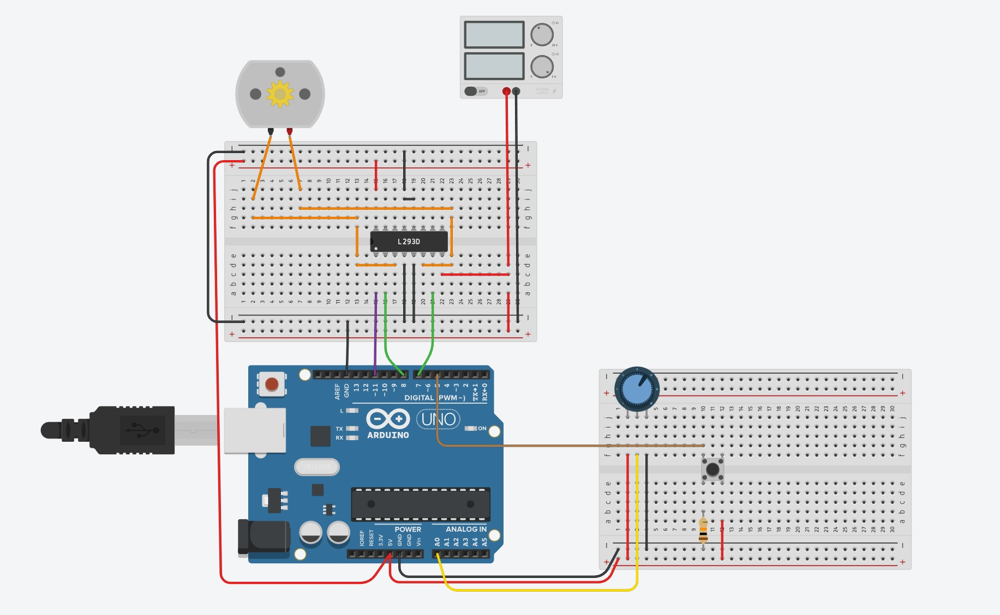
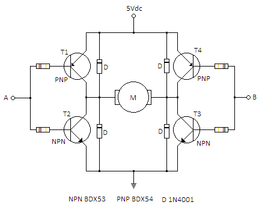

# L293D_Motor_Driver

L293D Quadruple Half H-Bridge

# Gestione del pulsante di start/stop

Bisogna specificare all'inizio del programma su quale piedino colleghiamo il pulsante di start/stop che consente di avviare/bloccare la marcia

    const int start_Stop_Button = 5;

Nella fase di setup dovremo pertanto impostare il piedino come ingresso:

    pinMode(start_Stop_Button, INPUT);

Al termine della fase di setup si inserisce la seguente chiamata:

    motore_pronto();
    
Ossia il motore passa da inattivo a pronto. Nella funzione richiamata si stampa la frase "motore pronto" sul monitor seriale. Poi si abilita il ponte A di alimentazione del motore A e poi si imposta il verso di marcia.

# Abilitazione ponte H di controllo A

L'abilitazione del ponte avviene tramite il piedino 11 del microcontrollore

    const int enable = 11;

che deve pertanto essere impostato come OUTPUT nella fase di setup.

Come si vede dallo schema elettrico:

- il mezzo ponte 1A è controllato tramite il piedino 8 
- il mezzo ponte 2A è controllato tramite il piedino 7 

      const int controllo_ramo_1A = 8; 
      const int controllo_ramo_2A = 7;
      
I due piedini devono essere impostati come OUTPUT nel setup.
 
# Controllo del verso di marcia

- controllo_ramo_1A -> HIGH  controllo_ramo_2A -> LOW   il motore ruota in senso orario
- controllo_ramo_1A -> LOW   controllo_ramo_2A -> HIGH  il motore ruota in senso antiorario

Questo perchè nel primo caso i transistor alto sinistro e basso destro sono attivi nel ponte H. Nel secondo caso invece sono attivi il transistor 
in basso a sinistra e in alto a destra

I due comandi devono pertanto essere sempre uno il complemento dell'altro. 

    digitalWrite(controllo_ramo_1A,  HIGH); 
    digitalWrite(controllo_ramo_2A,  LOW);
    
Se i due comandi sono posti entrambi alti o bassi si ha la frenatura rapida del motore.

# La funzione completa "motore pronto":

    void motore_pronto()
        { 
           //Abilito il ponte H di alimentazione motore A
            
          digitalWrite(enable,HIGH);
          
          //Decido il verso di marcia
            
          digitalWrite(controllo_ramo_1A, LOW); //senso orario
          digitalWrite(controllo_ramo_2A,HIGH);
          
          Serial.println("Motore pronto....");
           
          //se non si preme Start/Stop si resta in un loop infinito
  
          while(digitalRead(start_Stop_Button) != HIGH);
          delay(100);
          
          Serial.println("Motore avviato.....");
          
        }    
        
 Nella funzione è stata inserita una trappola:

 while(digitalRead(start_Stop_Button) != HIGH);

 L'istruzione crea un loop infinito che può essere interrotto solo schiacciando il push button di start/stop, visto che normalmente sul piedino del pulsante ho valore LOW.
 
 # Fase di loop 
 
 Nella fase di loop si imposta la velocità del motore tramite il potenziometro che controlla la tensione sul piedino analogico A0:
 
    int pot = analogRead(A0); //
    
 Questa tensione sarà nell'intervallo 0V 5V dando un valore numerico compreso tra 0 e 1023.
 
    int duty = (pot/1023.0)*255;
 
 Lo riporto tra 0 e 255 per il controllo PWM dell'alimentazione motore. Controllo se i valori letti sono esatti:

    Serial.print("A0 = ");
    Serial.println(pot);
  
 Si abilita/disabilita il ponte ad alta frequenza creando dei buchi nell'alimentazione tramite tecnica PWM
    
    analogWrite(enable, duty); 
  
  Controllo se i calcoli sono esatti:
  	
    Serial.print("duty cycle = ");
    Serial.println(duty);
 
 
 Fine del loop...........Fine del programma
 
 
 # Codice di gestione dello stop (opzionale)
 
 All'inizio del loop inserisco il codice di gestione dell'arresto del motore:
 
    if(digitalRead(start_Stop_Button) != LOW)
     { 
      delay(100);
      digitalWrite(controllo_ramo_1A, HIGH); //senso orario
      digitalWrite(controllo_ramo_2A, HIGH);
      Serial.println("Stop ");
      
      //Si torna allo stato di pronto
      motore_pronto();
      }  
 
 

